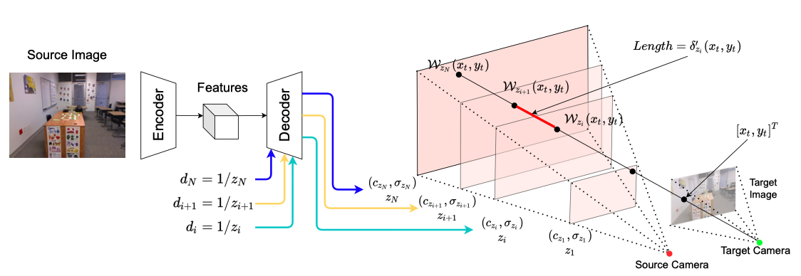

# MINE: Continuous-Depth MPI with Neural Radiance Fields
### [Project Page](https://vincentfung13.github.io/projects/nemi/) | [YouTube](https://youtu.be/I_92BXju350) | [bilibili](https://www.bilibili.com/video/BV1qR4y1H7F1/)
PyTorch implementation for our ICCV 2021 paper.<br><br>
[MINE: Towards Continuous Depth MPI with NeRF for Novel View Synthesis](https://vincentfung13.github.io/projects/nemi/)  
 [Jiaxin Li](https://www.jiaxinli.me/)\*<sup>1</sup>,
 [Zijian Feng](https://vincentfung13.github.io/)\*<sup>1</sup>,
 [Qi She](http://scholar.google.com/citations?user=iHoGTt4AAAAJ&hl=en)<sup>1</sup>,
 [Henghui Ding](https://henghuiding.github.io/)<sup>1</sup>,
 [Changhu Wang](http://scholar.google.com.sg/citations?user=DsVZkjAAAAAJ&hl=en)<sup>1</sup>,
 [Gim Hee Lee](https://www.comp.nus.edu.sg/~leegh)<sup>2</sup> <br>
 <sup>1</sup>ByteDance, <sup>2</sup>National University of Singapore  
  \*denotes equal contribution  

Our MINE takes a single image as input and densely reconstructs the frustum of the camera, through which we can easily render novel views of the given scene:


The overall architecture of our method:



## Run training on the LLFF dataset:

Firstly, set up your conda environment:
```
conda env create -f environment.yml 
conda activate MINE
```

Download the pre-downsampled version of the LLFF dataset from [Google Drive](https://drive.google.com/file/d/1sV7ioO_bintNg4U33YfUpFDD782OY8NI/view?usp=sharing), unzip it and put it in the root of the project, then start training by running the following command:
```
sh start_training.sh MASTER_ADDR="localhost" MASTER_PORT=1234 N_NODES=1 GPUS_PER_NODE=2 NODE_RANK=0 WORKSPACE=/run/user/3861/vs_tmp DATASET=llff VERSION=debug EXTRA_CONFIG='{"training.gpus": "0,1"}'
```

You may find the tensorboard logs and checkpoints in the sub-working directory (WORKSPACE + VERSION). 

Apart from the LLFF dataset, we experimented on the RealEstate10K, KITTI Raw and the Flowers Light Fields datasets - the data pre-processing codes and training flow for these datasets will be released later.

## Running our pretrained models:

We release the pretrained models trained on the RealEstate10K, KITTI and the Flowers datasets:

|    Dataset    |  N | Input Resolution | Download Link |
|:-------------:|:--:|:----------------:|:-------------:|
| RealEstate10K | 32 |      384x256     |  [Google Drive](https://drive.google.com/drive/folders/1otJH4O_p6v96r-PHw_8c7dS-ketKHi2o?usp=sharing) |
| RealEstate10K | 64 |      384x256     |  [Google Drive](https://drive.google.com/drive/folders/1bD-DRjoX7UcKTI2WjoDaU3lCXZBzoI7n?usp=sharing) |
|     KITTI     | 32 |      768x256     |  [Google Drive](https://drive.google.com/drive/folders/1z91uK68D0NJOoWODm3_t1i7PGV6VitbN?usp=sharing) |
|     KITTI     | 64 |      768x256     |  [Google Drive](https://drive.google.com/drive/folders/11VFBhycjLfycZI8IfL44pk9TwuqN8n0q?usp=sharing) |
|    Flowers    | 32 |      512x384     |  [Google Drive](https://drive.google.com/drive/folders/10BHWynkL1XYMjGMtCwtUJ0zsIhhpMOnv?usp=sharing) |
|    Flowers    | 64 |      512x384     |  [Google Drive](https://drive.google.com/drive/folders/1kjhGrLznurjaBk5zcibyMSG2UC7Hb-jr?usp=sharing) |

To run the models, download the checkpoint and the hyper-parameter yaml file and place them in the same directory, then run the following script:
```
python3 visualizations/image_to_video.py --checkpoint_path MINE_realestate10k_384x256_monodepth2_N64/checkpoint.pth --gpus 0 --data_path visualizations/home.jpg --output_dir .
```


## Citation

If you find our work helpful to your research, please cite our paper:
```
@inproceedings{mine2021,
  title={MINE: Towards Continuous Depth MPI with NeRF for Novel View Synthesis},
  author={Jiaxin Li and Zijian Feng and Qi She and Henghui Ding and Changhu Wang and Gim Hee Lee},
  year={2021},
  booktitle={ICCV},
}
```
